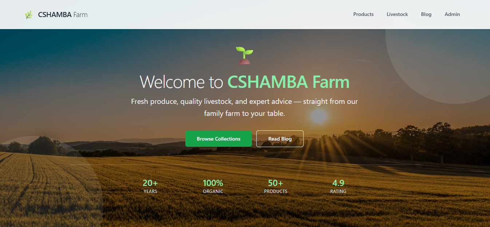

<!-- 📸 SCREENSHOT: Project structure showing all apps -->

---

## 📸 Shamba Farm System

### **Homepage & Navigation**

| | |
|:---:|:---:|
| **Homepage** | **Mobile View** |
|  | <!-- 📸 SCREENSHOT: Mobile hamburger menu --> |
| *Clean, welcoming interface with farm theme* | *Responsive design on mobile devices* |

### **Authentication System**

| | |
|:---:|:---:|
| **Login Page** | **Registration Form** |
| <!-- 📸 SCREENSHOT: Custom login form --> | <!-- 📸 SCREENSHOT: Registration with user type --> |
| *Secure authentication with Django* | *User type selection (Farmer/Customer)* |

| | |
|:---:|:---:|
| **Profile Page** | **Permission Denied** |
| <!-- 📸 SCREENSHOT: User profile with avatar --> | <!-- 📸 SCREENSHOT: Error message for unauthorized access --> |
| *Profile management with image upload* | *Role-based access control* |

### **Farmer Dashboard**

| | |
|:---:|:---:|
| **Overview Dashboard** | **Inventory Management** |
| <!-- 📸 SCREENSHOT: Farmer dashboard with stats --> | <!-- 📸 SCREENSHOT: Product list with edit options --> |
| *Sales charts, low stock alerts, recent orders* | *CRUD operations for products* |

| | |
|:---:|:---:|
| **Add Product Form** | **Livestock Tracking** |
| <!-- 📸 SCREENSHOT: Product form with image upload --> | <!-- 📸 SCREENSHOT: Livestock list with health status --> |
| *File upload, category selection, price fields* | *Complex animal tracking system* |

### **E-Commerce Functionality**

| | |
|:---:|:---:|
| **Product Listing** | **Product Detail** |
| <!-- 📸 SCREENSHOT: Products with filters and search --> | <!-- 📸 SCREENSHOT: Single product with quantity selector --> |
| *Advanced filtering by category, type, price* | *Dynamic quantity selector, add to cart* |

| | |
|:---:|:---:|
| **Shopping Cart** | **AJAX Add to Cart** |
| <!-- 📸 SCREENSHOT: Cart page with items and total --> | <!-- 📸 SCREENSHOT: Success modal after adding --> |
| *Session-based cart management* | *No page reload, smooth UX* |

| | |
|:---:|:---:|
| **Checkout Page** | **Order Confirmation** |
| <!-- 📸 SCREENSHOT: Order form with address --> | <!-- 📸 SCREENSHOT: Success page with order number --> |
| *Transaction handling, address validation* | *Order tracking number generation* |

### **Blog System**

| | |
|:---:|:---:|
| **Blog Listing** | **Article Detail** |
| <!-- 📸 SCREENSHOT: Blog posts with categories --> | <!-- 📸 SCREENSHOT: Full article with author info --> |
| *Category filtering, search, popular posts* | *Author attribution, view counting* |

| | |
|:---:|:---:|
| **Write Article** | **Category Filter** |
| <!-- 📸 SCREENSHOT: Article form for farmers --> | <!-- 📸 SCREENSHOT: Filtered articles by category --> |
| *Rich text content creation* | *URL parameter filtering* |

### **Services & Booking**

| | |
|:---:|:---:|
| **Services List** | **Booking Form** |
| <!-- 📸 SCREENSHOT: Farm services available --> | <!-- 📸 SCREENSHOT: Date picker for booking --> |
| *Service offerings display* | *Date validation, booking system* |

### **Admin Interface**

| | |
|:---:|:---:|
| **Custom Admin** | **Inline Models** |
| <!-- 📸 SCREENSHOT: Django admin with custom filters --> | <!-- 📸 SCREENSHOT: Order with order items inline --> |
| *Search, filters, list display customization* | *Complex admin relationships* |

### **Database & Code**

| | |
|:---:|:---:|
| **Models.py** | **URLs Configuration** |
| <!-- 📸 SCREENSHOT: Model code showing relationships --> | <!-- 📸 SCREENSHOT: Main urls.py with includes --> |
| *ForeignKeys, ManyToMany, custom methods* | *Clean URL routing structure* |

| | |
|:---:|:---:|
| **Class-Based Views** | **Database Schema** |
| <!-- 📸 SCREENSHOT: View with mixins --> | <!-- 📸 SCREENSHOT: PostgreSQL table structure --> |
| *Reusable code with inheritance* | *Well-designed database* |

---

## 📦 Installation Guide

### **Prerequisites**
- Python 3.10+
- PostgreSQL 17+
- Git
- Virtual Environment (recommended)

### **Step-by-Step Installation**

```bash
# 1. Clone the repository
git clone https://github.com/yourusername/cshamba.git
cd cshamba

# 2. Create and activate virtual environment
python -m venv venv
# Windows:
venv\Scripts\activate
# Mac/Linux:
source venv/bin/activate

# 3. Install dependencies
pip install -r requirements.txt

# 4. Create PostgreSQL database
psql -U postgres
CREATE DATABASE cshamba_db;
CREATE USER cshamba_user WITH PASSWORD 'your_password';
ALTER ROLE cshamba_user SET client_encoding TO 'utf8';
ALTER ROLE cshamba_user SET default_transaction_isolation TO 'read committed';
ALTER ROLE cshamba_user SET timezone TO 'UTC';
GRANT ALL PRIVILEGES ON DATABASE cshamba_db TO cshamba_user;
\q

# 5. Configure environment variables
# Create .env file in project root
echo "SECRET_KEY=your_secret_key_here" > .env
echo "DB_NAME=cshamba_db" >> .env
echo "DB_USER=cshamba_user" >> .env
echo "DB_PASSWORD=your_password" >> .env
echo "DB_HOST=localhost" >> .env
echo "DB_PORT=5432" >> .env

# 6. Run migrations
python manage.py makemigrations users inventory livestock sales blog services core
python manage.py migrate

# 7. Create superuser
python manage.py createsuperuser

# 8. Collect static files
python manage.py collectstatic

# 9. Run development server
python manage.py runserver